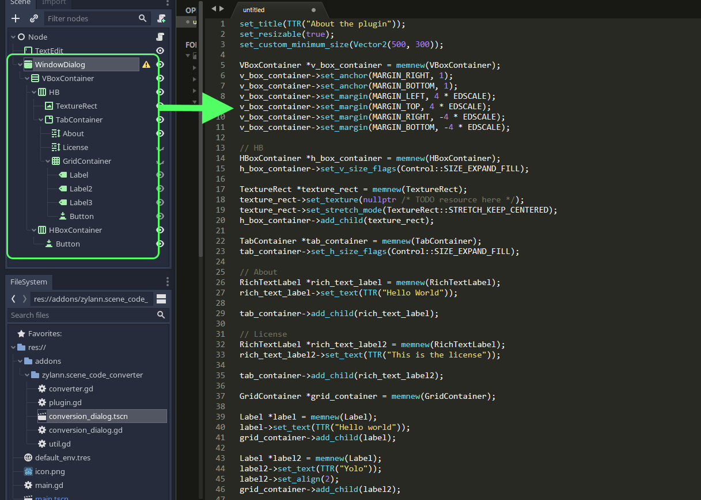

Scene code converter
=======================

This plugin helps you convert any branch of nodes into C++ engine code that can be used to develop the Godot Editor. This is particularly useful for making GUIs, and the plugin was primarily developped towards this goal.

Installation
--------------

This is a regular editor plugin.
Copy the contents of `addons/zylann.scene_code_converter` into the same folder in your project, and activate it in your project settings.

Usage
------

- Open the Godot Editor and open the scene containing the nodes you want to convert
- When the plugin is activated, a new button will appear in the main viewport's toolbar, in `2D` mode.
- Select the root node of the branch you want to convert
- Click the `Convert to engine code` button
- This will open a popup with the generated code. It may be pasted in the constructor of the root node's C++ class, and will build a copy of the selected node and all its children.
- You may want to adjust a few things in the generated code:
	- Names are generated. If you wish to keep some nodes as member variables, you should replace them.
	- It's possible that some of the code is invalid. In that case you may adjust it, and eventually do a PR to fix it, when possible.
	- Sometimes nodes have resources on them like textures, but in engine code resources are handled differently. The plugin currently leaves them out.

